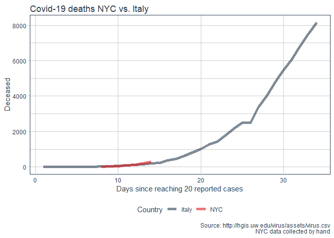
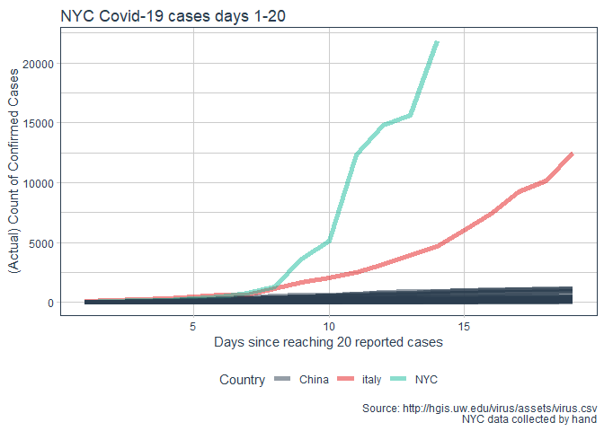

Modeling Scenarios for Covid-19
================

# Data from: <https://github.com/jakobzhao/virus>

``` r
library(tidyverse)
library(tidyquant)
library(crayon)
library(kableExtra)
library(ggrepel)

theme_set(theme_tq())
```

``` r
# updated every ~4 hours
# cases_data <- suppressMessages(read_csv("http://hgis.uw.edu/virus/assets/virus.csv"))

latest_file <- paste0("hgis virus data/",Sys.Date()," virus.csv")
if(!file.exists(latest_file)){
  
  download.file("http://hgis.uw.edu/virus/assets/virus.csv", destfile = latest_file)
  
}

cases_data <- suppressMessages(read_csv(latest_file))


message("Data from ", min(cases_data$datetime)," to ",max(cases_data$datetime))
```

    ## Data from 2020-01-21 to 2020-03-16

``` r
max_date <- 
  cases_data %>% 
  select(datetime, `new york`) %>% 
  na.omit() %>% summarise(max_date = max(datetime)) %>% 
  pull(max_date)

ny_cases <- 
  cases_data %>% 
  select(datetime, `new york`) %>% 
  na.omit() %>% 
  separate(`new york`, into = c("Confirmed","Suspected","Cured","Deaths")
           , sep = "-", extra = "warn", remove = F) %>% 
  mutate_at(vars(Confirmed:Deaths), as.numeric) %>% 
  mutate(Active = Confirmed+Suspected-Cured-Deaths) %>%
  filter(datetime == max(datetime))


message("Number of confirmed NY cases as of ",max_date,": ", ny_cases$Confirmed,"\n")
```

    ## Number of confirmed NY cases as of 2020-03-16: 729

``` r
message("Number of active NY cases as of ",max_date,": ",ny_cases$Active)
```

    ## Number of active NY cases as of 2020-03-16: 723

# Process case data

``` r
source("04 - Process Case Data.R")
```

# NYC cases vs. advanced scenarios: Italy and Chinese provinces

``` r
source("00 - Recording NYC Cases.R")


processed %>% 
  filter(Country%in%c("China","italy"), area!="hubei") %>%  
  bind_rows(NYC_reports %>% mutate(Country = "NYC")) %>% 
  group_by(area) %>% 
  filter(Confirmed>20) %>% 
  mutate(days_since_reported = 1:n()) %>% 
  ggplot()+
  aes(x = days_since_reported, y = Confirmed, group = area, color = Country)+
  geom_line(size = 2, alpha = 0.6) + 
  theme_tq()+
  scale_color_tq()+
  theme(legend.position = "bottom")+
  scale_y_log10()+
  labs(title = "NYC Covid-19 cases currently tracking closer to Italy than Chinese provinces"
       , y = "Log Scale Count of Confirmed Cases"
       , x = "Days since reaching 20 reported cases"
       , caption = "Source: http://hgis.uw.edu/virus/assets/virus.csv\n NYC data collected by hand")
```

<!-- -->

``` r
processed %>% 
  filter(Country%in%c("China","italy"), area!="hubei") %>%  
  bind_rows(NYC_reports %>% mutate(Country = "NYC")) %>% 
  arrange(desc(Country)) %>% 
  group_by(area) %>% 
  filter(Confirmed>20) %>% 
  mutate(days_since_reported = 1:n()) %>% 
  filter(days_since_reported<20) %>% 
  ggplot()+
  aes(x = days_since_reported, y = Confirmed, group = area, color = Country)+
  geom_line(size = 2, alpha = 0.5) + 
  theme_tq()+
  scale_color_tq()+
  theme(legend.position = "bottom")+
 labs(title = "NYC Covid-19 cases days 1-20"
       , y = "(Actual) Count of Confirmed Cases"
       , x = "Days since reaching 20 reported cases"
       , caption = "Source: http://hgis.uw.edu/virus/assets/virus.csv\n NYC data collected by hand")
```

<!-- -->

``` r
library(DT)
NYC_reports %>%
  datatable(options = list(paging = F, searching = F))
```

<!-- -->

# US States

``` r
processed %>% 
  filter(area%in% us_state_names) %>% 
  group_by(area) %>% 
  filter(Confirmed>20) %>% 
  mutate(days_since_reported = 1:n()) %>% 
   mutate(label = if_else(days_since_reported == max(days_since_reported) & Confirmed>100
                         , as.character(area), NA_character_)) %>%
  ggplot()+
  aes(x = days_since_reported, y = Confirmed, color = area)+
  geom_line(size = 1)+
  geom_label_repel(aes(label = label),
                   nudge_x = 1,
                   na.rm = TRUE) +
  theme_tq()+
  scale_color_tq(theme = "light")+
  labs(x = "Days since reaching 20 cases"
       , y = "Confirmed Cases")
```

<!-- -->

``` r
processed %>% 
  filter(area%in% us_state_names) %>% 
  group_by(area) %>% 
  filter(Confirmed>20) %>% 
  mutate(days_since_reported = 1:n()) %>% 
  ggplot()+
  aes(x = days_since_reported, y = Confirmed, color = area)+
  geom_line(size = 1)+
  theme_tq()+
  scale_color_tq(theme = "light")+
  scale_y_log10()+
  labs(x = "Days since reaching 20 cases"
       , y = "Confirmed Cases log scale")
```

<!-- -->

# Active Cases

``` r
processed %>% 
  filter(Country!="Other") %>% 
  ggplot()+
  aes(x = days_since_reported, y = Active, group = area, label = area, color = Country)+
  geom_line()
```

<!-- -->

# Most advanced cases - Chinese Provinces

``` r
processed %>% 
  filter(Country=="China", area!="hubei") %>% 
  ggplot()+
  aes(x = days_since_reported, y = Active, group = area, label = area, color = Country)+
  geom_line()
```

<!-- -->

# US

``` r
processed %>% 
  filter(Country=="US") %>% 
  ggplot()+
  aes(x = days_since_reported, y = Confirmed, color = area)+
  geom_line()
```

<!-- -->

# Western Countries

``` r
processed %>% 
  filter(area%in% c("us","canada","france","australia"
                    ,"germany","israel","uk","greece","spain")) %>% 
  group_by(area) %>% 
  filter(Confirmed>20) %>% 
  mutate(days_since_reported = 1:n()) %>% 
  mutate(label = if_else(days_since_reported == max(days_since_reported) 
                         , as.character(area), NA_character_)) %>%
  ggplot()+
  aes(x = days_since_reported, y = Active, color = area)+
  geom_line()+
  geom_label_repel(aes(label = label),
                   nudge_x = 1,
                   na.rm = TRUE) +
  theme_tq()+
  scale_color_tq()+
  labs(x = "Days since reaching 20 cases"
       , y = "Active Cases")
```

<!-- -->

``` r
processed %>% 
  filter(area%in% c("us","canada","france","australia","germany","israel","spain","italy")) %>% 
  group_by(area) %>% 
  filter(Confirmed>20) %>% 
  mutate(days_since_reported = 1:n()) %>% 
  mutate(label = if_else(days_since_reported == max(days_since_reported) #& Active>500
                         , as.character(area), NA_character_)) %>%
  ggplot()+
  aes(x = days_since_reported, y = Active, color = area)+
  geom_line()+
  geom_label_repel(aes(label = label),
                   nudge_x = 1,
                   na.rm = TRUE) +
  theme_tq()+
  scale_color_tq()+
  scale_y_log10()+
  labs(x = "Days since reaching 20 cases"
       , y = "Active Cases Log Scale")
```

<!-- -->

# New York

``` r
processed %>% 
  filter(area %in% "new york") %>% 
  ggplot()+
  aes(x = datetime, y = Active, color = area)+
  geom_line()
```

<!-- -->

# MODELING

``` r
library(modelr)

not_na_processed <- 
  processed %>% 
  mutate(Country = as.factor(Country)) %>% 
  filter(!is.na(days_since_reported)) %>% 
  group_by(area) %>% 
  filter(Active>20) %>% 
  mutate(days_since_reported = 1:n()) %>% 
  ungroup() %>% 
  select(-c(first_reported, cases, Confirmed:Deaths)) 

country_model <- function(data){
  loess(Active~days_since_reported
        , data = data
        #, control = loess.control(surface = "direct")
  )    
}

model_all <- not_na_processed %>% country_model()

model_western <- not_na_processed %>% 
  filter(Country%in% c("US","canada","france","australia","germany","israel")) %>% 
  country_model()

model_us_states <- not_na_processed %>% 
  filter(area %in% us_state_names) %>% 
  country_model()

model_japan <- not_na_processed %>% 
  filter(area=='japan') %>% 
  country_model()

model_italy <- not_na_processed %>% 
  filter(area=='italy') %>% 
  country_model()

model_china_ex_wuhan <- not_na_processed %>% 
  filter(Country=='China', area != "hubei") %>% 
  country_model()

model_france <- not_na_processed %>% 
  filter(Country=='france') %>% 
  country_model()

model_germany <- not_na_processed %>% 
  filter(Country=='germany') %>% 
  country_model()


actual_nyc <- 
  not_na_processed %>% 
  filter(area=="new york") %>% 
  filter(days_since_reported>0) %>% 
  select(days_since_reported, "Actual Active" = Active) %>% 
  mutate(model = "Actual Active") 

max_days <- actual_nyc %>% 
  summarise(days = max(days_since_reported)) %>% 
  pull(days)


not_na_processed %>% 
  group_by(area) %>% 
  filter(Active>20) %>% 
  mutate(days_since_reported = 1:n()) %>% 
  ungroup() %>% 
  data_grid(area, days_since_reported) %>% 
  filter(area=="new york") %>% 
  
  
  add_predictions(model_all, var = "world model") %>%
  add_predictions(model_japan, var = "japan model") %>%
  add_predictions(model_china_ex_wuhan, var = "china model") %>%
  add_predictions(model_france, var = "france model") %>%
  add_predictions(model_germany, var = "germany model") %>%
  
  
  
  gather(model, prediction, -area, -days_since_reported) %>% 
  ggplot()+
  aes(days_since_reported, y = prediction, color = model)+
  geom_line(size = 1)+
  geom_line(data = actual_nyc, aes(y = `Actual Active`), linetype = 1, size = 2)+
  geom_vline(xintercept = max_days, color = "black", size = 1)+
  theme_tq()+
  scale_color_tq()+
  labs(title = "New York City Active Case Scenarios"
       , subtitle = "black line denotes NYC actual days since reported"
       , y = "Predicted Active Cases"
       , x = "Days since reacihng 20 reported cases")
```

<!-- -->
