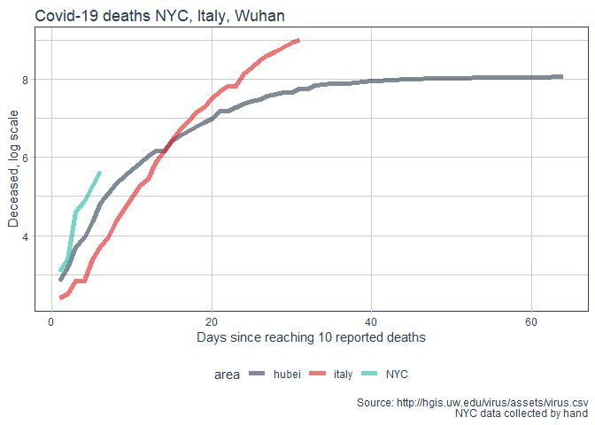
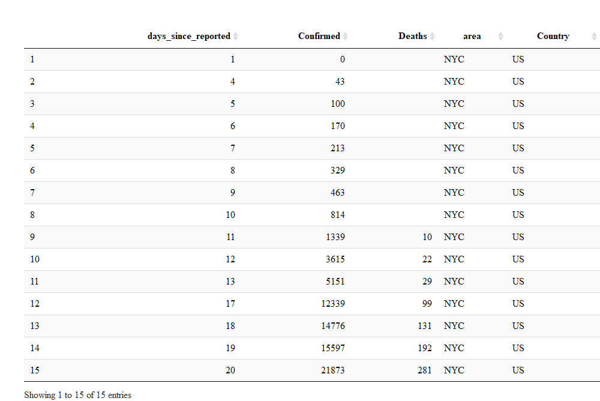
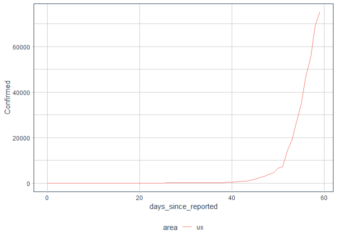

Modeling Scenarios for Covid-19
================

# Data from: <https://github.com/jakobzhao/virus>

``` r
library(tidyverse)
library(tidyquant)
library(crayon)
library(kableExtra)
library(ggrepel)

theme_set(theme_tq())
```

``` r
# updated every ~4 hours
# cases_data <- suppressMessages(read_csv("http://hgis.uw.edu/virus/assets/virus.csv"))

latest_file <- paste0("hgis virus data/",Sys.Date()," virus.csv")
if(!file.exists(latest_file)){
  
  download.file("http://hgis.uw.edu/virus/assets/virus.csv", destfile = latest_file)
  
}

cases_data <- suppressMessages(read_csv(latest_file))


message("Data from ", min(cases_data$datetime)," to ",max(cases_data$datetime))
```

    ## Data from 2020-01-21 to 2020-03-24

``` r
max_date <- 
  cases_data %>% 
  select(datetime, `new york`) %>% 
  na.omit() %>% summarise(max_date = max(datetime)) %>% 
  pull(max_date)

ny_cases <- 
  cases_data %>% 
  select(datetime, `new york`) %>% 
  na.omit() %>% 
  separate(`new york`, into = c("Confirmed","Suspected","Cured","Deaths")
           , sep = "-", extra = "warn", remove = F) %>% 
  mutate_at(vars(Confirmed:Deaths), as.numeric) %>% 
  mutate(Active = Confirmed+Suspected-Cured-Deaths) %>%
  filter(datetime == max(datetime))


message("Number of confirmed NY cases as of ",max_date,": ", ny_cases$Confirmed,"\n")
```

    ## Number of confirmed NY cases as of 2020-03-24: 25665

``` r
message("Number of active NY cases as of ",max_date,": ",ny_cases$Active)
```

    ## Number of active NY cases as of 2020-03-24: 25455

# Process case data

``` r
source("04 - Process Case Data.R")
```

# NYC cases vs. advanced scenarios: Italy and Chinese provinces

``` r
source("00 - Recording NYC Cases.R")
```

    ## # A tibble: 24 x 3
    ##    Var                value percent
    ##    <chr>              <chr>   <dbl>
    ##  1 Total              15597      NA
    ##  2 Median Age (Range) 46          0
    ##  3 Age Group          <NA>       NA
    ##  4 -  0 to 17         384         2
    ##  5 -  18 to 44        7094       46
    ##  6 -  45 to 64        5194       33
    ##  7 -  65 to 74        1689       11
    ##  8 -  75 and over     1227        8
    ##  9 -  Unknown         9          NA
    ## 10 Age 50 and over    <NA>       NA
    ## 11 -  Yes             6787       44
    ## 12 -  No              8801       56
    ## 13 Sex                <NA>       NA
    ## 14 -  Female          6736       43
    ## 15 -  Male            8838       57
    ## 16 -  Unknown         23         NA
    ## 17 Borough            <NA>       NA
    ## 18 -  Bronx           2505       16
    ## 19 -  Brooklyn        4407       28
    ## 20 -  Manhattan       3013       19
    ## 21 -  Queens          4667       30
    ## 22 -  Staten Island   999         6
    ## 23 -  Unknown         6          NA
    ## 24 Deaths             192        NA

``` r
processed %>% 
  filter(Country%in%c("China","italy"), area!="hubei") %>%  
  bind_rows(NYC_reports %>% mutate(Country = "NYC")) %>% 
  group_by(area) %>% 
  filter(Confirmed>20) %>% 
  mutate(days_since_reported = 1:n()) %>% 
  ggplot()+
  aes(x = days_since_reported, y = Confirmed, group = area, color = Country)+
  geom_line(size = 2, alpha = 0.6) + 
  theme_tq()+
  scale_color_tq()+
  theme(legend.position = "bottom")+
  scale_y_log10()+
  labs(title = "NYC Covid-19 cases currently tracking closer to Italy than Chinese provinces"
       , y = "Log Scale Count of Confirmed Cases"
       , x = "Days since reaching 20 reported cases"
       , caption = "Source: http://hgis.uw.edu/virus/assets/virus.csv\n NYC data collected by hand")
```

<!-- -->

``` r
processed %>% 
  filter(area%in%c("US","italy")) %>%  
  bind_rows(NYC_reports %>% mutate(Country = "NYC")) %>% 
  group_by(area) %>% 
  filter(Confirmed>20) %>% 
  mutate(days_since_reported = 1:n()) %>% 
  ggplot()+
  aes(x = days_since_reported, y = Deaths, group = area, color = Country)+
  geom_line(size = 2, alpha = 0.6) + 
  theme_tq()+
  scale_color_tq()+
  theme(legend.position = "bottom")+
  labs(title = "Covid-19 deaths NYC vs. Italy"
       , y = "Deceased"
       , x = "Days since reaching 20 reported cases"
       , caption = "Source: http://hgis.uw.edu/virus/assets/virus.csv\n NYC data collected by hand")
```

<!-- -->

``` r
processed %>% 
  filter(Country%in%c("China","italy"), area!="hubei") %>%  
  bind_rows(NYC_reports %>% mutate(Country = "NYC")) %>% 
  arrange(desc(Country)) %>% 
  group_by(area) %>% 
  filter(Confirmed>20) %>% 
  mutate(days_since_reported = 1:n()) %>% 
  filter(days_since_reported<20) %>% 
  ggplot()+
  aes(x = days_since_reported, y = Confirmed, group = area, color = Country)+
  geom_line(size = 2, alpha = 0.5) + 
  theme_tq()+
  scale_color_tq()+
  theme(legend.position = "bottom")+
 labs(title = "NYC Covid-19 cases days 1-20"
       , y = "(Actual) Count of Confirmed Cases"
       , x = "Days since reaching 20 reported cases"
       , caption = "Source: http://hgis.uw.edu/virus/assets/virus.csv\n NYC data collected by hand")
```

<!-- -->

``` r
library(DT)
NYC_reports %>%
  datatable(options = list(paging = F, searching = F))
```

<!-- -->

# US States

``` r
processed %>% 
  filter(area%in% us_state_names) %>% 
  group_by(area) %>% 
  filter(Confirmed>20) %>% 
  mutate(days_since_reported = 1:n()) %>% 
   mutate(label = if_else(days_since_reported == max(days_since_reported) & Confirmed>1000
                         , as.character(area), NA_character_)) %>%
  ggplot()+
  aes(x = days_since_reported, y = Confirmed, color = area)+
  geom_line(size = 1)+
  geom_label_repel(aes(label = label),
                   nudge_x = 1,
                   na.rm = TRUE) +
  theme_tq()+
  theme(legend.position = "none")+
  scale_color_tq(theme = "light")+
  labs(x = "Days since reaching 20 cases"
       , y = "Confirmed Cases")
```

<!-- -->

``` r
processed %>% 
  filter(area%in% us_state_names) %>% 
  group_by(area) %>% 
  filter(Confirmed>20) %>% 
  mutate(days_since_reported = 1:n()) %>% 
  ggplot()+
  aes(x = days_since_reported, y = Confirmed, color = area)+
  geom_line(size = 1)+
  theme_tq()+
  scale_color_tq(theme = "light")+
  scale_y_log10()+
  labs(x = "Days since reaching 20 cases"
       , y = "Confirmed Cases log scale")
```

<!-- -->

# Active Cases

``` r
processed %>% 
  filter(Country!="Other") %>% 
  filter(Active>20) %>% 
  group_by(area) %>% 
  mutate(days_since_reported=1:n()) %>% 
  mutate(label = ifelse(days_since_reported==max(days_since_reported) & 
                            Active>2000, area, NA_character_)) %>% 
  ggplot()+
  aes(x = days_since_reported, y = Active, group = area, label = area, color = Country)+
  geom_line()+
  
  geom_text(aes(label = label))+
  scale_color_tq()+
  theme_tq()+
  theme(plot.title.position = "plot")+
  labs(title = "Active Cases Worldwide"
       , x = "days since reacing 20 active cases")
```

<!-- -->

# Most advanced cases - Chinese Provinces

``` r
processed %>% 
  filter(Country=="China", area!="hubei") %>% 
  ggplot()+
  aes(x = days_since_reported, y = Active, group = area, label = area, color = Country)+
  geom_line()
```

<!-- -->

# US

``` r
processed %>% 
  filter(Country=="US") %>% 
  ggplot()+
  aes(x = days_since_reported, y = Confirmed, color = area)+
  geom_line()
```

<!-- -->

# Western Countries

``` r
processed %>% 
  filter(area%in% c("us","canada","france","australia"
                    ,"germany","israel","uk","greece","spain")) %>% 
  group_by(area) %>% 
  filter(Confirmed>20) %>% 
  mutate(days_since_reported = 1:n()) %>% 
  mutate(label = if_else(days_since_reported == max(days_since_reported) 
                         , as.character(area), NA_character_)) %>%
  ggplot()+
  aes(x = days_since_reported, y = Active, color = area)+
  geom_line()+
  geom_label_repel(aes(label = label),
                   nudge_x = 1,
                   na.rm = TRUE) +
  theme_tq()+
  scale_color_tq()+
  labs(x = "Days since reaching 20 cases"
       , y = "Active Cases")
```

<!-- -->

``` r
processed %>% 
  filter(area%in% c("us","canada","france","australia","germany","israel","spain","italy")) %>% 
  group_by(area) %>% 
  filter(Confirmed>20) %>% 
  mutate(days_since_reported = 1:n()) %>% 
  mutate(label = if_else(days_since_reported == max(days_since_reported) #& Active>500
                         , as.character(area), NA_character_)) %>%
  ggplot()+
  aes(x = days_since_reported, y = Active, color = area)+
  geom_line()+
  geom_label_repel(aes(label = label),
                   nudge_x = 1,
                   na.rm = TRUE) +
  theme_tq()+
  scale_color_tq()+
  scale_y_log10()+
  labs(x = "Days since reaching 20 cases"
       , y = "Active Cases Log Scale")
```

<!-- -->

# New York State

``` r
processed %>% 
  filter(area %in% "new york") %>% 
  ggplot()+
  aes(x = datetime, y = Active, color = area)+
  geom_line()
```

<!-- -->

# MODELING
