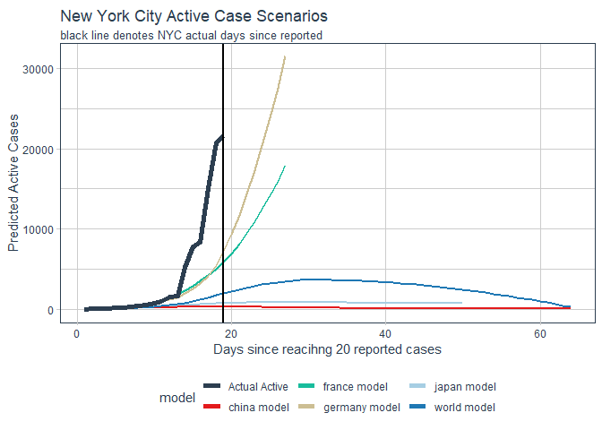

Modeling Scenarios for Covid-19
================

# Data from: <https://github.com/jakobzhao/virus>

``` r
library(tidyverse)
library(tidyquant)
library(crayon)
library(kableExtra)

theme_set(theme_tq())
```

``` r
# updated every ~4 hours
cases_data <- suppressMessages(read_csv("http://hgis.uw.edu/virus/assets/virus.csv"))


message("Data from ", min(cases_data$datetime)," to ",max(cases_data$datetime))
```

    ## Data from 2020-01-21 to 2020-03-15

``` r
max_date <- 
  cases_data %>% 
  select(datetime, `new york`) %>% 
  na.omit() %>% summarise(max_date = max(datetime)) %>% 
  pull(max_date)

ny_cases <- 
  cases_data %>% 
  select(datetime, `new york`) %>% 
  na.omit() %>% 
  separate(`new york`, into = c("Confirmed","Suspected","Cured","Deaths")
           , sep = "-", extra = "warn", remove = F) %>% 
  mutate_at(vars(Confirmed:Deaths), as.numeric) %>% 
  mutate(Active = Confirmed+Suspected-Cured-Deaths) %>%
  filter(datetime == max(datetime))


message("Number of confirmed NY cases as of ",max_date,": ", ny_cases$Confirmed,"\n")
```

    ## Number of confirmed NY cases as of 2020-03-15: 524

``` r
message("Number of active NY cases as of ",max_date,": ",ny_cases$Active)
```

    ## Number of active NY cases as of 2020-03-15: 522

# Names by country

``` r
china_names <- 
  cases_data %>% 
  select(anhui:zhejiang) %>% 
  names()

us_names <- 
  cases_data %>% 
  select(us:texas,florida:`georgia usa`) %>% 
  names()

mexico_names <- cases_data %>% select(mexico) %>% names()
uk_names <- cases_data %>% select(uk) %>% names()
canada_names <- cases_data %>% select(canada, ontario:quebec) %>% names()
south_korea_names <- cases_data %>% select(`south korea`) %>% names()
singapore_names <- cases_data %>% select(singapore) %>% names()
japan_names <- cases_data %>% select(japan) %>% names()
vietnam_names <- cases_data %>% select(vietnam) %>% names()
france_names <- cases_data %>% select(france) %>% names()
australia_names <- cases_data %>% select(australia) %>% names()
germany_names <- cases_data %>% select(germany) %>% names()
russia_names <- cases_data %>% select(russia) %>% names()
italy_names <- cases_data %>% select(italy) %>% names()
iran_names <- cases_data %>% select(iran) %>% names()
israel_names <- cases_data %>% select(israel) %>% names()


# The first sequel represents the number of confirmed cases, 
# the second sequel represents suspected cases, the third sequel 
# represents cured cases, the fourth sequel represents death cases.
processed <-
  cases_data %>% 
  gather(area, cases, -datetime) %>% 
  separate(cases, into = c("Confirmed","Suspected","Cured","Deaths")
           , sep = "-", extra = "warn", remove = F) %>% 
  mutate_at(vars(Confirmed:Deaths), function(x)ifelse(is.na(x),0,x)) %>% 
  mutate_at(vars(Confirmed:Deaths), as.numeric) %>% 
  mutate(Active = Confirmed+Suspected-Cured-Deaths) %>% 
  mutate(area = str_remove_all(area, "\\\\xa0")) %>% 
  mutate(first_reported = case_when(!is.na(cases)&is.na(lag(cases,1)) ~ 1
                                    , TRUE ~ NA_real_
  )) %>% 
  group_by(area) %>%
  mutate(first_reported = case_when(sum(first_reported, na.rm = T)==0&datetime==min(datetime) ~ 1
                                    , TRUE ~ first_reported
  )
  ) %>% 
  fill(first_reported, .direction = "down") %>% 
  mutate(count_report_days = case_when(first_reported  == 1~1, TRUE ~ 0)) %>% 
  mutate(days_since_reported = cumsum(count_report_days)) %>% 
  ungroup() %>% 
  mutate(Country = case_when(
    area %in% china_names ~ "China"
    , area %in% us_names ~ "US"
    , area %in% mexico_names ~ "Mexico"
    , area %in% uk_names ~ "UK"
    , area %in% canada_names ~ "canada"
    , area %in% south_korea_names ~ "south_korea"
    , area %in% singapore_names ~ "singapore"
    , area %in% japan_names ~ "japan"
    , area %in% vietnam_names ~ "vietnam"
    , area %in% france_names ~ "france"
    , area %in% australia_names ~ "australia"
    , area %in% germany_names ~ "germany"
    , area %in% russia_names ~ "russia"
    , area %in% italy_names ~ "italy"
    , area %in% iran_names ~ "iran"
    , area %in% israel_names ~ "israel"
    
    , TRUE ~ "Other"
  ))
```

# Overlaying NYC Cases with the Chinese Provinces (ex-Wuhan)

``` r
NYC_reports <- 
  tribble(~days_since_reported, ~Confirmed
          , 1, 0
          , 4, 43 # Wednesday 3/11
          , 5, 100 # Thursday 3/12
          , 6, 170 # Friday 3/13
          , 7, 213 # Saturday 3/14
          , 8, 269 # Sunday 3/15 as of 9:00 am

  ) %>% 
  mutate(area = "NYC", Country = "US")


# Most advanced cases - China
NYC_vs_China_cases <-
  processed %>% 
  filter(Country=="China", area!="hubei") %>% 
  ggplot()+
  aes(x = days_since_reported, y = Confirmed, group = area, label = area, color = Country)+
  geom_line(color = 2) + 
  geom_line(data = NYC_reports, color = "black", size = 2)+
  theme_tq()+
  scale_color_tq()+
  theme(legend.position = "none")+
  labs(title = "NYC Covid-19 cases vs. Chinese provinces"
       , subtitle = "Each line represents a Chinese province. Excludes Hubei (Wuhan).
Black line is NYC. Data current as of 2020-03-14"
, y = "Count of Confirmed Cases"
, x = "Days since outbreak first reported"
, caption = "Source: http://hgis.uw.edu/virus/assets/virus.csv\n NYC data collected by hand")

NYC_vs_China_cases
```

<!-- -->

``` r
NYC_reports %>%
  kable() %>%
  kable_styling(bootstrap_options = "striped", full_width = F)
```

<table class="table table-striped" style="width: auto !important; margin-left: auto; margin-right: auto;">

<thead>

<tr>

<th style="text-align:right;">

days\_since\_reported

</th>

<th style="text-align:right;">

Confirmed

</th>

<th style="text-align:left;">

area

</th>

<th style="text-align:left;">

Country

</th>

</tr>

</thead>

<tbody>

<tr>

<td style="text-align:right;">

1

</td>

<td style="text-align:right;">

0

</td>

<td style="text-align:left;">

NYC

</td>

<td style="text-align:left;">

US

</td>

</tr>

<tr>

<td style="text-align:right;">

4

</td>

<td style="text-align:right;">

43

</td>

<td style="text-align:left;">

NYC

</td>

<td style="text-align:left;">

US

</td>

</tr>

<tr>

<td style="text-align:right;">

5

</td>

<td style="text-align:right;">

100

</td>

<td style="text-align:left;">

NYC

</td>

<td style="text-align:left;">

US

</td>

</tr>

<tr>

<td style="text-align:right;">

6

</td>

<td style="text-align:right;">

170

</td>

<td style="text-align:left;">

NYC

</td>

<td style="text-align:left;">

US

</td>

</tr>

<tr>

<td style="text-align:right;">

7

</td>

<td style="text-align:right;">

213

</td>

<td style="text-align:left;">

NYC

</td>

<td style="text-align:left;">

US

</td>

</tr>

<tr>

<td style="text-align:right;">

8

</td>

<td style="text-align:right;">

269

</td>

<td style="text-align:left;">

NYC

</td>

<td style="text-align:left;">

US

</td>

</tr>

</tbody>

</table>

# Days since reported

``` r
processed %>% 
  filter(Country!="Other") %>% 
  ggplot()+
  aes(x = days_since_reported, y = Active, group = area, label = area, color = Country)+
  geom_line()
```

<!-- -->

# Most advanced cases - Chinese Provinces

``` r
processed %>% 
  filter(Country=="China", area!="hubei") %>% 
  ggplot()+
  aes(x = days_since_reported, y = Active, group = area, label = area, color = Country)+
  geom_line()
```

<!-- -->

# US

``` r
processed %>% 
  filter(Country=="US") %>% 
  ggplot()+
  aes(x = days_since_reported, y = Confirmed, color = area)+
  geom_line()
```

<!-- -->

# Western Countries

``` r
processed %>% 
  filter(Country%in% c("US","canada","france","australia","germany","israel")) %>% 
  ggplot()+
  aes(x = days_since_reported, y = Active, color = area)+
  geom_line()
```

<!-- -->

# New York

``` r
processed %>% 
  filter(area %in% "new york") %>% 
  ggplot()+
  aes(x = datetime, y = Active, color = area)+
  geom_line()
```

<!-- -->

# MODELING

``` r
library(modelr)

not_na_processed <- 
  processed %>% 
  mutate(Country = as.factor(Country)) %>% 
  filter(!is.na(days_since_reported)) %>% 
  group_by(area) %>% 
  filter(Active>20) %>% 
  mutate(days_since_reported = 1:n()) %>% 
  ungroup() %>% 
  select(-c(first_reported, cases, Confirmed:Deaths)) 

country_model <- function(data){
  loess(Active~days_since_reported
        , data = data
        #, control = loess.control(surface = "direct")
  )    
}

model_all <- not_na_processed %>% country_model()

model_western <- not_na_processed %>% 
  filter(Country%in% c("US","canada","france","australia","germany","israel")) %>% 
  country_model()

model_us_states <- not_na_processed %>% 
  filter(area %in% us_names, area!='us') %>% 
  country_model()

model_japan <- not_na_processed %>% 
  filter(area=='japan') %>% 
  country_model()

model_italy <- not_na_processed %>% 
  filter(area=='italy') %>% 
  country_model()

model_china_ex_wuhan <- not_na_processed %>% 
  filter(Country=='China', area != "hubei") %>% 
  country_model()

model_france <- not_na_processed %>% 
  filter(Country=='france') %>% 
  country_model()

model_germany <- not_na_processed %>% 
  filter(Country=='germany') %>% 
  country_model()


actual_nyc <- 
  not_na_processed %>% 
  filter(area=="new york") %>% 
  filter(days_since_reported>0) %>% 
  select(days_since_reported, "Actual Active" = Active) %>% 
  mutate(model = "Actual Active") 

max_days <- actual_nyc %>% 
  summarise(days = max(days_since_reported)) %>% 
  pull(days)


not_na_processed %>% 
  group_by(area) %>% 
  filter(Active>20) %>% 
  mutate(days_since_reported = 1:n()) %>% 
  ungroup() %>% 
  data_grid(area, days_since_reported) %>% 
  filter(area=="new york") %>% 
  
  
  add_predictions(model_all, var = "world model") %>%
  add_predictions(model_japan, var = "japan model") %>%
  add_predictions(model_china_ex_wuhan, var = "china model") %>%
  add_predictions(model_france, var = "france model") %>%
  add_predictions(model_germany, var = "germany model") %>%

    
  gather(model, prediction, -area, -days_since_reported) %>% 
  ggplot()+
  aes(days_since_reported, y = prediction, color = model)+
  geom_line(size = 1)+
  geom_line(data = actual_nyc, aes(y = `Actual Active`), linetype = 1, size = 2)+
  geom_vline(xintercept = max_days, color = "black", size = 1)+
  theme_tq()+
  scale_color_tq()+
  labs(title = "New York City Active Case Scenarios"
       , subtitle = "black line denotes NYC actual days since reported"
       , y = "Predicted Active Cases"
       , x = "Days since first reported cases")
```

<!-- -->
